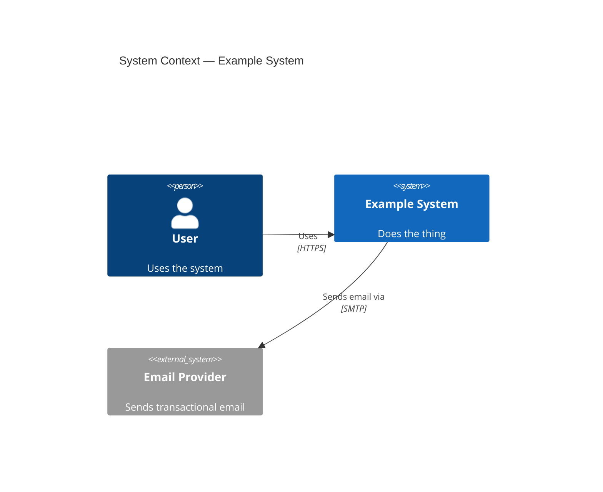
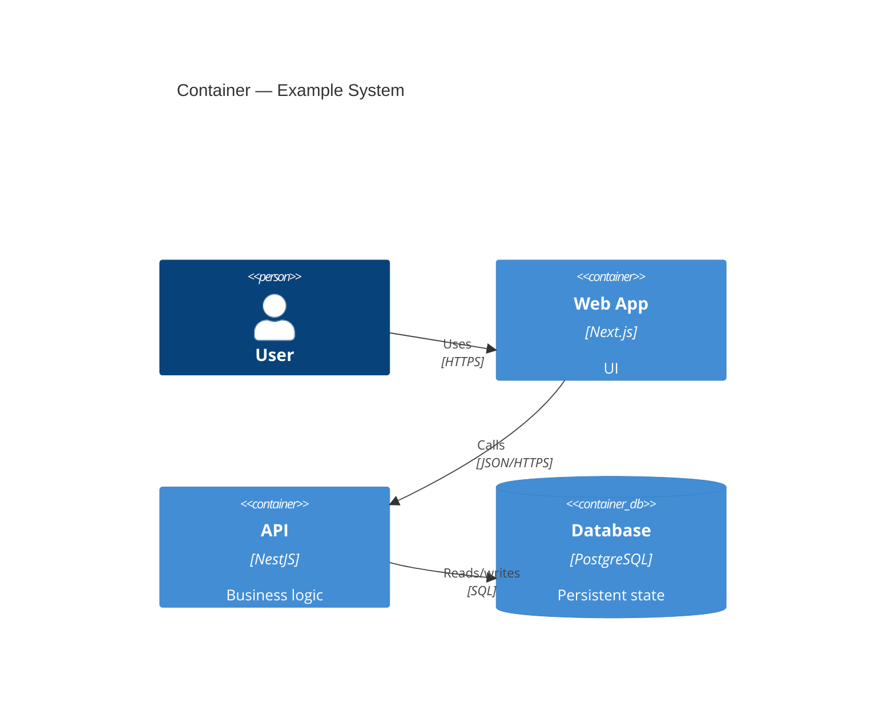

# C4 Model — Guidelines & Conventions

The C4 model describes software architecture at four zoom levels. Use only the
levels your audience needs; the Context and Container levels cover most needs.

## Levels

1. **System Context** — the system as a single box, its users (people), and the
   external systems it interacts with. Audience: everyone.
2. **Container** — deployable/runnable units (web app, API service, database,
   message broker) and how they communicate. Audience: technical stakeholders.
   *Usually the highest-value diagram.*
3. **Component** — components within a single container. Use only where it earns
   its maintenance cost.
4. **Code** — classes/schema. Rarely worth drawing by hand; generate if needed.

## Conventions

- **One level per diagram.** Never mix Context and Container elements.
- **Label every relationship** with intent *and* technology, e.g.
  `Reads/writes → [SQL/TCP]`, `Sends events → [Kafka]`.
- Distinguish **people**, the **system in scope**, and **external systems**
  visually (color/shape).
- Keep element names and responsibilities short; detail belongs in arc42.
- Default to **text-based** diagrams (Mermaid or Structurizr DSL) checked into
  the repo so they version alongside code, unless there's a compelling reason
  otherwise.

## Mermaid — System Context example

## Mermaid — Container example

---

Reviewing a diagram against these conventions is
`references/review-checklist.md`'s job — see its **C4 diagram** entry under
*Artifact-specific additions*. This file holds conventions and examples only, so
that there is exactly one review bar in the plugin rather than a private one per
artifact type.